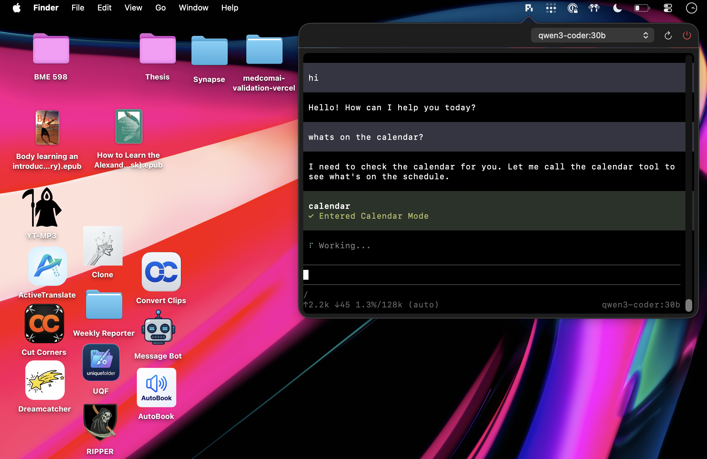

# Pi Quick Access

[](https://www.apple.com/macos/)
[](https://swift.org)
[](https://opensource.org/licenses/MIT)

A premium, lightweight macOS menu bar interface for the **Pi Agent**. Pi Quick Access provides a seamless, terminal-integrated chat experience that sits right in your status bar, allowing you to interact with your local and cloud-based LLMs instantly.



## Features

- **Menu Bar Integration**: Quick access to your AI agent from anywhere on macOS.
- **Terminal-Powered Chat**: Uses `SwiftTerm` for a robust, high-performance terminal interface.
- **Model Management**: Easily switch between available Ollama models directly from the UI.
- **Process Lifecycle Management**: Automatically handles starting, stopping, and cleaning up agent processes (including aggressive cleanup of zombie processes).
- **Premium Aesthetics**: Curated color palettes and smooth animations for a modern Mac feel.
- **Unread Notifications**: Subtle icon badges when the agent has output waiting for you.

## Prerequisites

Before installing Pi Quick Access, ensure you have the following installed:

1. **Pi Agent**: The core CLI tool. Pi Quick Access expects the `pi` executable to be located at `/usr/local/bin/pi`.
2. **Ollama**: Required for local model execution. Expected at `/usr/local/bin/ollama`.
3. **macOS 14.0+**: Leverages modern SwiftUI and AppKit APIs.

## Installation

### From Source

1. Clone the repository:
   ```bash
   git clone https://github.com/[YOUR_USERNAME]/pi-quick-access.git
   cd pi-quick-access
   ```

2. Build and package the application:
   ```bash
   ./scripts/build_app.sh
   ```

3. Run the application:
   ```bash
   open QuickAccessAgent.app
   ```

### Manual Build

If you prefer to run it via Swift Package Manager:
```bash
swift run qae
```

## Usage

- **Click the Menu Bar Icon**: Toggle the chat interface.
- **Right-Click Icon**: Access the context menu to quit the application.
- **Model Selector**: Switch models on the fly. The agent will restart automatically with the new model.
- **Commands**: Interaction follows the standard `pi` CLI patterns.

## Development

To run in development mode with live logs:
```bash
swift run qae
```

## License

This project is licensed under the MIT License - see the [LICENSE](LICENSE) file for details.

## Acknowledgments

- [SwiftTerm](https://github.com/migueldeicaza/SwiftTerm) for the terminal emulation.
- The Pi Agent team for the core engine.
